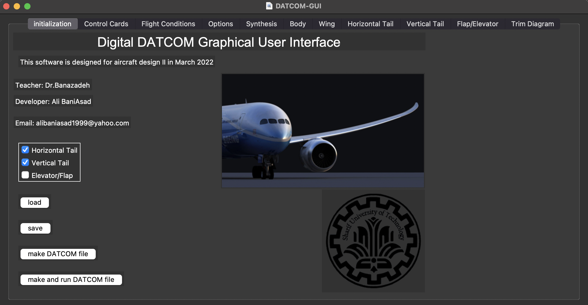
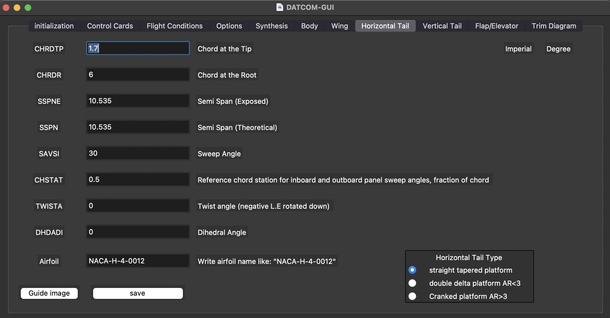

# DATCOM-GUI
Graphical user interface for DATCOM USAF
## how to use
1. Download the DATCOM executable from [here](https://www.pdas.com/datcomdownload.html)
2. Extract the zip file
3. Run the executable
4. Select the desired options
5. Click on the "Run" button
6. The output file will be generated in the same folder as the executable
## how to use the GUI
1. Clone the repository
2. Install the requirements
3. Run the main.py file
4. Select the desired options
5. load saved data
6. Click on the "Make DATCOM file" or "Make and run DATCOM file"
7. The output file will be generated in the same folder as the executable
### Program Interface

